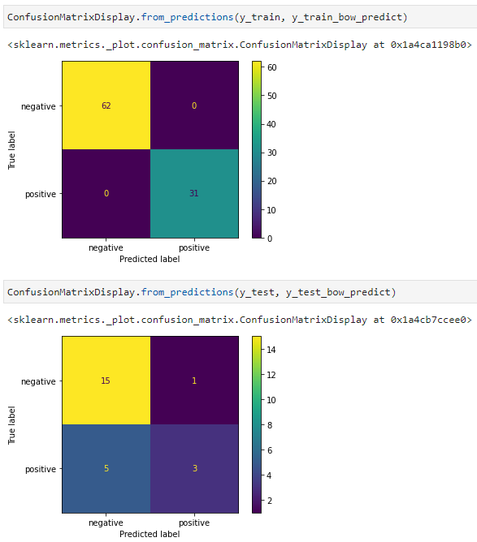
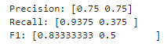
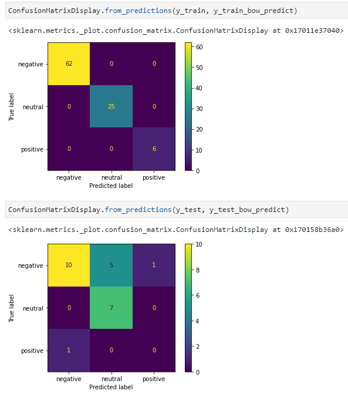
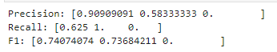

# social-networks-analysis (Workshop 3)
## Members:
- León Vargas Boris Nicolas
- Losada Ordoñez Mateo Alejandro
- Garnica Ortiz Diego Fernando

## Youtube Video:
- https://youtu.be/lWmRzWtgVaY

## High-level functionality

- We made a method that is in charge of loading or creating the respective datasets for each scenario. The method reads the path of each file that is necessary and if the file does'n exists it creates it. After this process the method extracts from the whole dataset of the excel a sample of it. It creates 3 samples in which each one is going to have 30%, 60% and 100% of the data in the original dataset, this with the objectivo of using different quantities in the training process in a progressive way.

- 3 scenarios were created and each one has its own file (scenario-one, scenario-two, scenario-three) and settings depending on the requiremets of the workshop. Whit these scenarios we made some tests with the suggested parameters in the different algorithms and we selected one common settings for the comparing process. In the same way, we opted for using the vectorization method (BoW) because it gave us better results in some cases. 

## Results:

- All the results were gathered in the next file:
https://docs.google.com/spreadsheets/d/1Pg7YmJKU30ZSfBYTVc6A_xp1-dOgoYSXY5Qqt1NJOWY/edit?usp=sharing

- Taking into account the previous file we selected as viwepoint the MLPClassifier with hidden_layer_sizes=(200, 200, 200). 

- The best results were obtainded by the MLPClassifier, specificaly in the first scenario, and the MultinomialNB in the third one. Besides the more congruent results were obtained by the MLPClassifier method. This can be seen in the next images:

## MultinomialNB Grapghs

## MultinomialNB results

## MLPClassifier Grapghs

## MLPClassifier results

#### Conclusions
- In first place, we noted a tendency where the more data, it ended up being more efficient. Or at least, this can be said with the higher amount of data on this case which was 395 and the mentioned algorithms.

- Then, about scenario comparison we found that in the scenario number 2, where the neutral elements were deleted, it helped the increase of precision of negative elements in regard to the other two scenarios. However escenario 3 had a much greater positive precision.

#### Instructions

+ Clone this repository
+ Make sure you have the correct libraries installed (especially nltk and sklearn), with their respective version
+ Open a command line console and go inside the repo's directory and run the command "jupyter lab"

+ Run each code block to the end. 
+ There are the graphics and the results of the program.